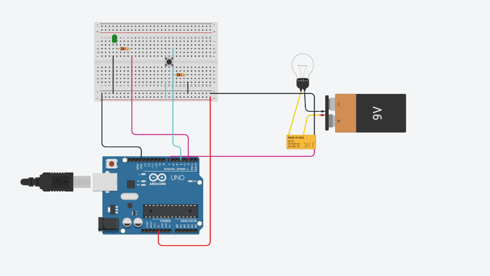

## electric forces and electrons task🗣:<br />

## Description📄: <br />
**Design a circuit that can be turned on and off automatically** <br />

## Circuit design :sparkles: :


## Hardware Required 🔨: 
○ Arduino Uno <br />
○ Relay DPDT <br />
○ LED <br />
○ Button <br />
○ Resistor <br />
○ Wires <br />
○ Breadboard <br />
○ Light bulb <br />
○ 9V Battery <br />

## The Code 👨‍💻 :
```c++
#define LED_PIN 2
#define BUTTON_PIN 4
#define Relay_PIN 7


byte lastButtonState = LOW;
byte ledState = LOW;


void setup() {
  pinMode(LED_PIN, OUTPUT);
  pinMode(BUTTON_PIN, INPUT);
  pinMode(Relay_PIN, OUTPUT);
}
void loop() {
  byte buttonState = digitalRead(BUTTON_PIN);
  if (buttonState != lastButtonState) {
    lastButtonState = buttonState;
    if (buttonState == LOW) {
      ledState = (ledState == HIGH) ? LOW: HIGH;
      digitalWrite(LED_PIN, ledState);
      digitalWrite(Relay_PIN, ledState);
    }
  }
}
```
<br />
## The simulation : <br /> 
- https://user-images.githubusercontent.com/106310608/182028203-28b28fd5-e4f0-421e-8d4e-61873c5afd6e.mp4


